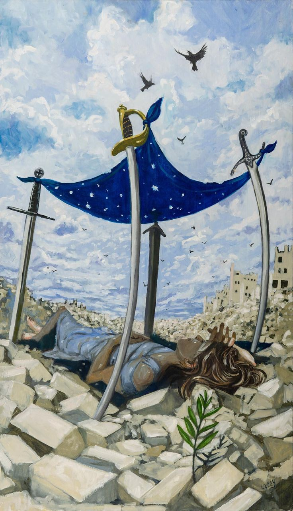
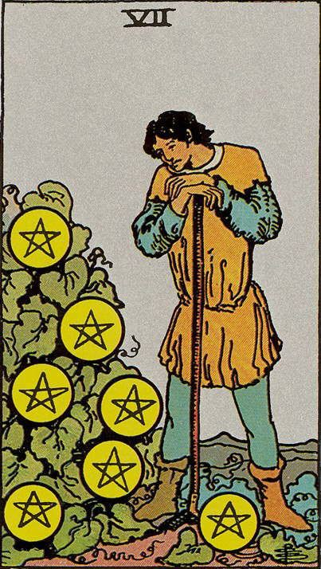

<html lang="pt-br">
    <head>
        <title>Somar valores de input</title>
        <meta charset="utf-8">
        <link rel="stylesheet" href="reset.css">
    
  
    </head>
    <body>
        

        <h1>Seu Ano Pessoal Na Númerologia & Tarot</h1>
      
            

                
Dia De Nascimento:

                <input class="num1" type="number"> 
                
Mês de Aniversário:

                <input class="num2" type="number">  
                
                <button onclick="clicar()">Resultado</button>
                  
                

                 
                
Some o resultado acima até chegar a um número de 1 a 9 caso tenha 0 corte
<b> 
                
Observação: Seu ano pessoal começa a valer a partir da sua data de aniversário e muda no próximo.  
                Este é um conteúdo vendido sobre demanda então caso tenha interesse entre em contato para agendar!.
                

            

           

            

          <!--AnosPessoais-->
          <input type="checkbox" id="btn-a">
          <button id="btn-1">
          <!-- botão pessoa -->
          <label for= "btn-a" >
            
<strong>Ano Pessoal 1</strong>

          </label>
          </button>
           
          

            

              
Ano Marcado Por Novos
              Inícios E Recomeços
<a href="https://wa.me/5524992717594?text=Olá+Gostaria+De+Saber+Mais+Sobre+As+Consultas+Online">
                Adquirir Leitura Completa
                nas Áreas:</a>
                
<b>Sentimental,
                   Material
                    & Tomada de 
                   Decisões</b>

                
                
                
                 
             

          

          
         
          <input type="checkbox" id="btn-b">
          <button id="btn-2">
          <!-- botão pessoa -->
          <label for= "btn-b" >
            
<strong>Ano Pessoal 2</strong>

          </label>
          </button>
           
          

            

              
Ano Marcado pelas Parcerias & Uniões importantes
              
<a href="https://wa.me/5524992717594?text=Olá+Gostaria+De+Saber+Mais+Sobre+As+Consultas+Online">
                Adquirir Leitura Completa
                nas Áreas:</a>
                
<b>Sentimental,
                   Material &
                   Tomadas 
                   Decisões</b>

                
                
                
                 
             

          

          
         <input type="checkbox" id="btn-c">
          <button id="btn-2">
          <!-- botão pessoa -->
          <label for= "btn-c" >
            
<strong>Ano Pessoal 3</strong>

          </label>
          </button>
           
          

            

              
Ano Marcado pelas Comunicações Sociais
              
<a href="https://wa.me/5524992717594?text=Olá+Gostaria+De+Saber+Mais+Sobre+As+Consultas+Online">
                Adquirir Leitura Completa
                nas Áreas:</a>
                
<b>Sentimental,
                   Material &
                   Tomadas 
                   Decisões</b>

                
                
                
                 
             

          

          
         <input type="checkbox" id="btn-d">
          <button id="btn-2">
          <!-- botão pessoa -->
          <label for= "btn-d" >
            
<strong>Ano Pessoal 4</strong>

          </label>
          </button>
           
          

            

              
Ano Marcado pelo trabalho e a família 
              
<a href="https://wa.me/5524992717594?text=Olá+Gostaria+De+Saber+Mais+Sobre+As+Consultas+Online">
                Adquirir Leitura Completa
                nas Áreas:</a>
                
<b>Sentimental,
                   Material &
                   Tomadas 
                   Decisões</b>

                
                
                
                 
             

          

          
         <input type="checkbox" id="btn-e">
          <button id="btn-2">
          <!-- botão pessoa -->
          <label for= "btn-e" >
            
<strong>Ano Pessoal 5</strong>

          </label>
          </button>
           
          

            

              
Ano Marcado pelas Mudanças Pessoais 
              
<a href="https://wa.me/5524992717594?text=Olá+Gostaria+De+Saber+Mais+Sobre+As+Consultas+Online">
                Adquirir Leitura Completa
                nas Áreas:</a>
                
<b>Sentimental,
                   Material &
                   Tomadas 
                   Decisões</b>

                
                
                
                 
             

          

          
         <input type="checkbox" id="btn-f">
          <button id="btn-2">
          <!-- botão pessoa -->
          <label for= "btn-f" >
            
<strong>Ano Pessoal 6</strong>

          </label>
          </button>
           
          

            

              
Ano Marcado Pela vida sentimental & Romances 
              
<a href="https://wa.me/5524992717594?text=Olá+Gostaria+De+Saber+Mais+Sobre+As+Consultas+Online">
                Adquirir Leitura Completa
                nas Áreas:</a>
                
<b>Sentimental,
                   Material &
                   Tomadas 
                   Decisões</b>

                
                
                
                 
             

          

          
         <input type="checkbox" id="btn-g">
          <button id="btn-2">
          <!-- botão pessoa -->
          <label for= "btn-g" >
            
<strong>Ano Pessoal 7</strong>

          </label>
          </button>
           
          

            

              
Ano Marcado pelo Autoconhecimento & a espiritualidade 
              
<a href="https://wa.me/5524992717594?text=Olá+Gostaria+De+Saber+Mais+Sobre+As+Consultas+Online">
                Adquirir Leitura Completa
                nas Áreas:</a>
                
<b>Sentimental,
                   Material &
                   Tomadas 
                   Decisões</b>

                
                
                
                 
             

          

          
         <input type="checkbox" id="btn-h">
          <button id="btn-2">
          <!-- botão pessoa -->
          <label for= "btn-h" >
            
<strong>Ano Pessoal 8</strong>

          </label>
          </button>
           
          

            

              
Ano Marcado pelo Poder Pessoal & Financeiro 
              
<a href="https://wa.me/5524992717594?text=Olá+Gostaria+De+Saber+Mais+Sobre+As+Consultas+Online">
                Adquirir Leitura Completa
                nas Áreas:</a>
                
<b>Sentimental,
                   Material &
                   Tomadas 
                   Decisões</b>

                
                
                
                 
             

          

          
         <input type="checkbox" id="btn-i">
          <button id="btn-2">
          <!-- botão pessoa -->
          <label for= "btn-i" >
            
<strong>Ano Pessoal 9</strong>

          </label>
          </button>
           
          

            

              
Ano Marcado por términos importantes em áreas da vida
              
<a href="https://wa.me/5524992717594?text=Olá+Gostaria+De+Saber+Mais+Sobre+As+Consultas+Online">
                Adquirir Leitura Completa
                nas Áreas:</a>
                
<b>Sentimental,
                   Material &
                   Tomadas 
                   Decisões</b>

                
                
                
                 
             

          

           
    
   
   </body>
</html>
